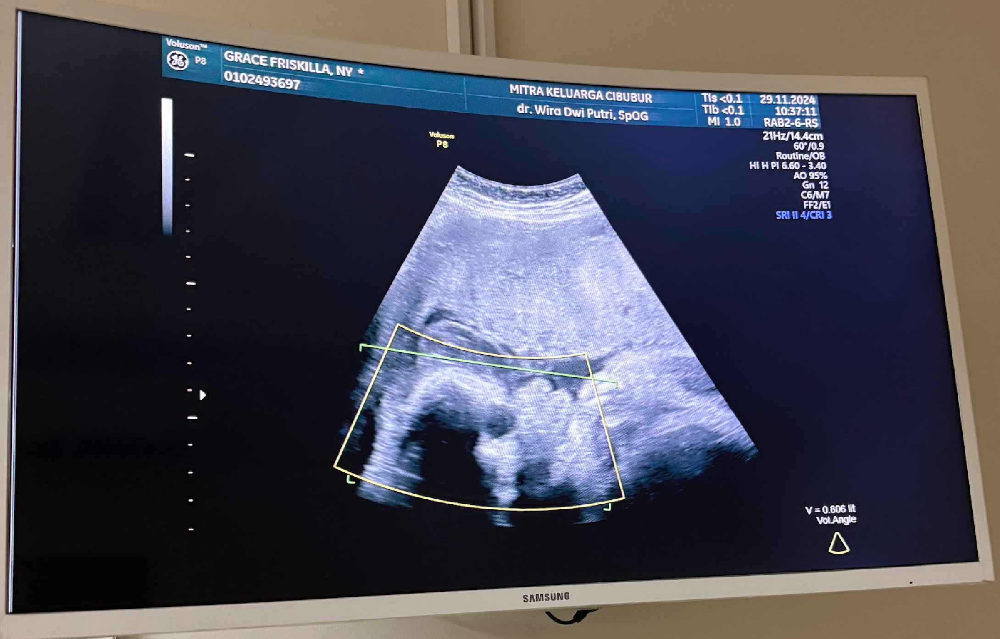
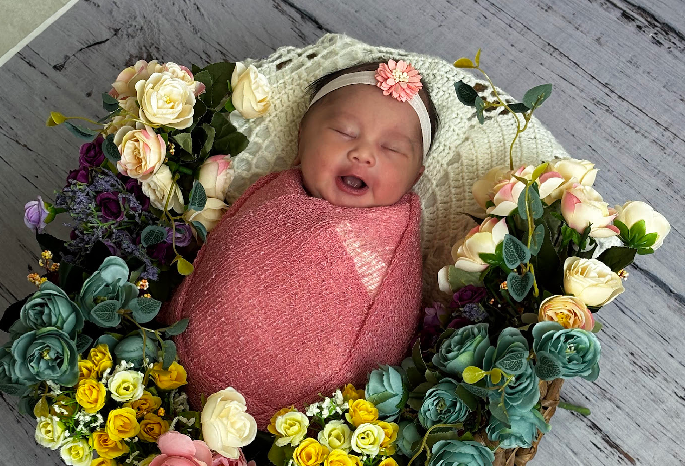
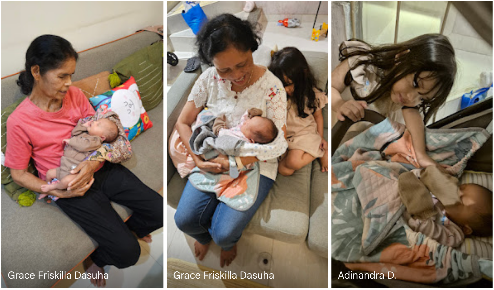
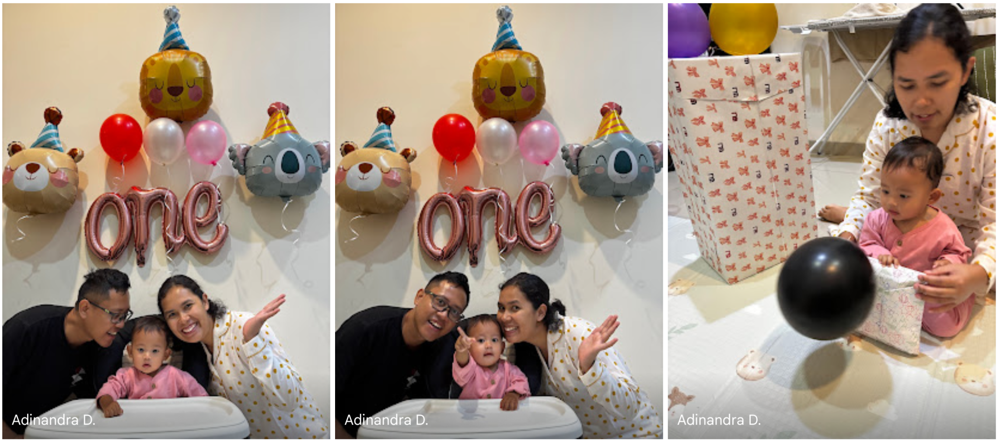

Adanya Jenar di tengah keluarga selama 1 tahun penuh ini membuat kami bertambah rasa syukurnya. Percaya dengan melihat tingkah lucu dan Jenar terus bertumbuh membuat semakin semangat dalam menjalani kehidupan. Memang perjalanan adanya Jenar tidak mulus bagi saya dan isteri dalam menantikan kehadirannya.

5 tahun keluarga saya menantikan buah hati. Jujur saya dan isteri tidak pernah terbesit sekali pun punya rasa iri melihat keluarga lain sudah langsung *ces pleng* punya momongan. Meski ada nyinyir dari orang lain, ada dukungan serta semangat dari keluarga dekat dan teman. Selain itu 2 daun telinga dan bola mata untuk memilah mana yang baik untuk didengarkan juga dilihat.

> Selama penantian kami berdua mengisi aktivitas dengan fokus dan misi.
> 

Ada sebuah sermon “*kebahagiaan itu seperti air di sebuah gelas, ketika airnya kurang dan mengambil dari gelas lain maka hanya mengurangi kebahagiaan di gelas lain, maka penuhilah airmu pada gelasmu sendiri karena kebahagiaan berawal dari diri sendiri*” Dari hal tersebut saya percaya kami harus tetap bahagia bahkan berlebih untuk memenuhi kebahagiaan anak kami.

Yang ada di pikiran kami agar bagaimana nanti anak kami kelak tidak perlu hidup susah, hidup susah tidak hanya perihal tentang materi tetapi juga batin. Maka dari itu selain menabung kami juga membuat hidup kami tetap senang dan tenang dengan ibadah, rekreasi, hobi, serta membangun relasi dengan keluarga serta kerabat.

Jenar bertumbuh dari bayi perempuan yang mungil yang awalnya hanya mager rebahan di tempat tidur mendengarkan alunan musik bayi, mulai belajar tummy time, dapat membalikkan badan, berteriak “*mak..pak*”, merangkak kencang, dan sekarang dapat berdiri juga mulai dapat berjalan dengan merambat.

Tidak mudah menemani Jenar dan ternyata *gelas-gelas kebahagiaan* terkadang tumpah. Mulai dari baby sitter yang resign dan akhirnya kami percayakan ke daycare ketika kami bekerja. Harus atur waktu antara bekerja dengan menjemput. Mengajak Jenar bermain juga belajar. Trip sederhana yang kalau di film tampak mudah ternyata aslinya ribet, namun yang penting happy.

Pertumbuhan Jenar kami iringi dengan hal-hal yang kiranya dapat membangun kepribadian serta fisiknya agar kelak menjadi anak yang membawa “cahaya kecantikan” yang menebarkan kebaikan. Maka dari itu “Jenar Jenges Lokasurya” disematkan sebagai namanya. Mengasuh itu menjadi berkat. Ternyata tidak hanya Jenar yang belajar, kami berdua juga belajar.

Selamat ulang tahun putriku. Cinta dari Tuhan, Bapak, dan Mamak selalu ada. Selalu andalkan Tuhan dalam setiap langkahmu, serahkan kekhawatiranmu padaNya agar kebahagiaanmu tetap penuh, berikan rasa optimismu juga lakukan yang terbaik untuk menjadi alatNya di dunia ini. Selamat bertumbuh dan menjadi berkat terindah. Terimakasih Jenar.

