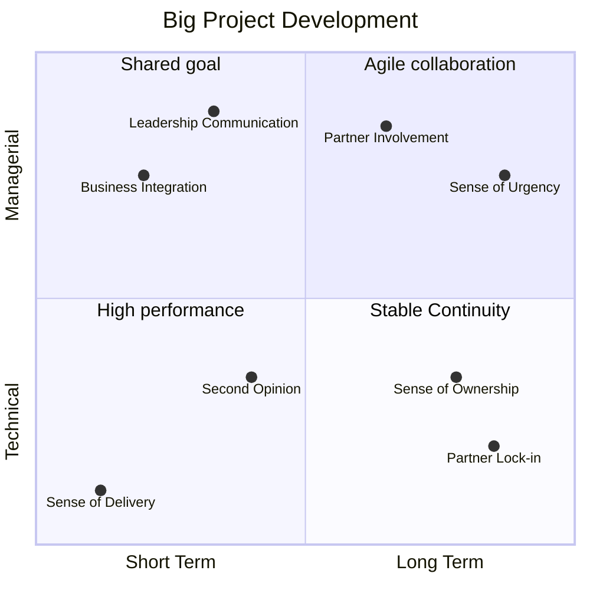
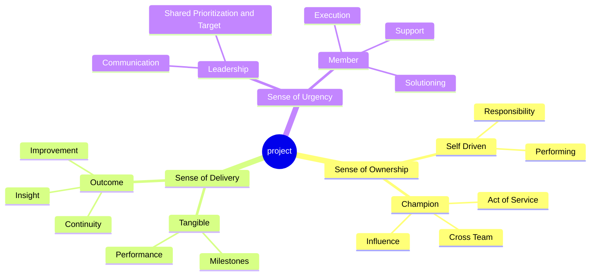

# 👥 Pembuka

Disclaimer saya tidak suka kata vendor karena pernah di posisi tersebut, sehingga lebih suka menyebutnya sebagai partner. Tetapi memang kata vendor kuat, karena secara gamblang adalah sebagai pihak luar yang dilibatkan. Jadi ijin menggunakan kata vendor tanpa ada maksud apapun. Lagi, saya pernah menjadi partner teknologi.

Di dalam bekerja saya selalu percaya bahwa hasil adalah yang utama, baik itu dilakukan secara individual ataupun kolaborasi. Pada tulisan berikut saya ingin menuangkan pemikiran tentang development proyek dengan skala besar, yang berdampak luas ke organisasi dan kerap butuh analisa untuk dieksekusi secara mandiri atau internal.

Beberapa waktu lalu sempat ada diskusi "_seharusnya sebuah perusahaan utilisasi tim internal teknis membangun sistem IT_". Pertanyaan dengan bab yang luas. Kalau merefleksikan, kapan saya butuh vendor untuk mengerjakan? Untuk menjawabnya pasti ada 3 sudut yang pertama kali dipikirkan yaitu _scope, resource,_ dan _budget_.

3 sudut yang menjadi segitiga menyebalkan dengan segala permutasinya. Tetapi katakanlah scope besar, resource mendukung, dan budget ada. Resource ini yang challenging karena butuh kolaborasi. Karena tidak semua orang sepemahaman apalagi jika tidak satu ada gap visi, kemampuan, silo, dan membawa agendanya masing-masing.

# 🧑🏽‍💻 Memulai In-House
Pada bagian pembuka sebetulnya sudah jelas, dengan adanya jumlah resource yang memadai baik jumlah serta skill bukan artinya eksekusi akan selaras. Adanya endorsement dari manajemen bukan jadi jaminan apalagi jika management juga silo dari top level. Saya akan mulai dengan ideal apabila ingin memulai IT development dengan in-house. 

## Sense yang Dibangun

Untuk dapat memulai proyek in-house dengan lancar harus ada 3 top sense yang dibutuhkan menurut pandangan saya. Ini teori yang ada di kepala dan menurut keyakinan pribadi saja. Ini juga yang berhasil dilakukan di Bank Mandiri oleh atasan saya terdahulu dan entah kenapa banyak perusahaan lain yang denial, padahal ketika diskusi atau interview mereka sadar bahwa hal tersebut valid.

### Sense of Urgency

Sebuah proyek besar yang digerakkan oleh urgensi menjadi krusial. Sekiranya di setiap coaching leadership pasti dibekali dengan pengetahuan mengenali kepribadian tim lewat DISC (Dominance, Influence, Steadiness, dan Conscientiousness). Apapun bentuk anggota, pasti masing-masing mewakili karakteristik tersebut. Satu hal yang pasti, mereka patuh dan selaras apabila diberikan urgensi.

Ketika semua tim in-house mendapatkan uraian kenapa development ini sangat penting, maka mereka akan tergerak. Dengan catatan urgensi tersampaikan oleh leader dengan tepat: 
1. Anggota dengan kepribadian Dominance (D) akan berambisi terhadap hasil dan milestone eksekusinya karena paham prioritas akan target oleh manajemen.
2. Anggota dengan kepribadian Influence (I) akan tergerak untuk segera berkolaborasi dengan tim lain karena paham prioritas ini tidak akan berjalan tanpa tim lain.
3. Anggota dengan kepribadian Steadiness (S) akan siap selalu support semua tim karena paham prioritas ini penting untuk kemashalatan bersama.
4. Anggota dengan kepribadian Conscientiousness (C) akan siap memikirkan solusinya segera dan seksama karena paham prioritas ini penuh tantangan.

### Sense of Ownership

Ownership atau kepemilikan tidak diatur oleh prioritas karena ownership itu karakter. Sama seperti kru di dalam satu kapal, tidak semua kru beranggapan bahwa tidak wajib rutin berlatih bersama karena belum akan melaut. Tetapi karakter yang mengutamakan ownership tidak akan memilah, dengan sendirinya sadar untuk kompak dan bertanggung jawab sesuai bidang meski belum akan melaut.

Ketika di proyek besar, ownership bermanfaat sebagai katalis atau penggerak tanpa perlu daya besar untuk diarahkan. Individu dengan karakter tersebut akan bertanggung jawab tanpa diminta terhadap apa yang dikerjakan apalagi dengan skala besar. Sehingga ada istilah _champion_ atau organik yang terpilih. 

Terkait role _champion_, harus personel yang memiliki ownership tinggi di bidangnya dan ditugaskan bersama _champion_ lain yang terlibat. Uniknya, perusahaan tidak perlu repot mendikte semua orang yang terlibat memiliki ownership. Itu seperti memberikan garam di lautan. Jadi memang tidak semua anggota menjadi _champion_, biarkan pengaruh itu menyebar dengan sendirinya. 

### Sense of Delivery

Adalah sebuah sikap untuk pro-aktif, berorientasi pada hasil, dan konsisten untuk menghasilkan outcome. Outcome, bukan hanya result yang tampak high perform. Outcome itu jangka panjang karena di sebuah proyek skala besar harus dijamin sustainabilitynya. Siapa yang akan menjadi penanggung jawabnya? Tentunya harus dari organik dari perusahaan itu sendiri.

Sikap ini mirip dengan mindset marathon yang harus dimiliki oleh personel organik yang terlibat dengan tetap memperhatikan pacenya. Harus tahu bagaimana cara menyelesaikan tasks, kapan harus cepat menyelesaikan milestone, kenapa masih ada yang tidak perform, dan apa target selanjutnya. Karena kompleksitas di skala besar itu banyak permutasi permasalahannya.

Jangan cepat puas adalah key takeaway yang saya dapatkan dari mantan SVP di Bank Mandiri. Dengan percaya diri saya menyatakan bahwa layanan channel loan skala nasional dan terintegrasi dengan multiple well known payment providers yang dibangun dalam waktu 4 bulan, mampu menangani ~5.000 s/d 10.000 req/s sesuai permintaan direktur bisnis. 

Apa yang beliau sampaikan masih terngiang hingga saat ini dan membentuk pola kepribadian. "_I heard, but that is not clear enough as I wonder on how much resources that must be wasted to achieve that results. If that so, then you shall judge by yourself for all that you have done_" Saya hanya fokus apa yang sudah achieve, tetapi tidak membawa apa yang dapat diimprove agar ke depan.

## Challenge

Development proyek secara in-house menjadi masuk akal apabila 3 top sense di atas terpenuhi. Terlepas dari budget yang dapat dialokasikan ke hal lain. Dan dengan catatan kenapa skill tidak dimasukkan? Karena di setiap organisasi pasti ada si perform, si medioker, dan si under perform. Dan masing-masing skill ini tidak mewakilkan sensenya, hanya mewakilkan resultnya.

Secara realita 3 top sense selalu terhalang oleh beberapa kebiasaan buruk dari in-house yang menjadi deal-breaker sebagai berikut

| Key Behavior | Driver | Sifat | Missing Sense | 
| --- | --- | --- | --- |
| **Tidak semua orang memiliki urgensi yang sama** | Leadership tidak cakap dan bahkan tidak memberikan urgensi kepada setiap anggota tim agar tergerak. Diberikan urgensi dan tergerak saja mungkin tidak optimal eksekusinya, apalagi jika tidak diberikan urgensi. | Eksekusi urgensi dengan atribusi daripada kontribusi. Hanya nama tercantum ada di meeting tetapi tidak bergerak, tidak sadar bahwa urgensi milik bersama. Pemberian dukungan antar tim menjadi terbatas. | _Sense of Urgency_, _Sense of Ownership_ |
| **Sudah punya agenda masing-masing** | Semua bagian sudah punya visi dan misi masing-masing tanpa ingin tahu atau ingin tahu tetapi dukungannya terbatas. Semua didasarkan terhadap goal dan target masing-masing tetapi minim konsolidasi. | Lamanya pengambilan keputusan. Adanya duplikasi solusi serta output, pekerjaan yang sama semakin banyak. Akhir hasil yang suboptimal terhadap costs di operasional di kemudian hari. | _Sense of Urgency_, _Sense of Delivery_ |
| **Banyak yang berpikir, tapi tidak semua bekerja** | Semua terlalu banyak menuangkan idealisme di awal tetapi minim menjalankan idenya, entah sebetulnya mampu atau tidak mampu. Saklek terhadap existing scope pekerjaannya dan anti terhadap dinamika perubahan requirement. | Ala kadarnya, menunda, bahkan menolak perubahan. Perhitungan yang tidak masuk akal terhadap effort dari pekerjaan hingga hasilnya tidak sesuai grand desain. Jadi beban optimalisasi di kemudian hari. | _Sense of Ownership_, _Sense of Delivery_ | 
| **Bekerja dengan silo raksasa yang terstruktur dan sistematis** | Adalah rangkuman dari semua baris di atas, masing-masing menjadi koloni pekerja yang dominan, paling benar, atau yang paling merasa seharusnya tidak dilibatkan (tapi ingin tetap dapat bagian). | Semua sifat negatif akan muncul: defensif, penimbunan informasi tanpa distribusi, dan ego sektoral terhadap duplikasi KPI. Hanya ada kata "aku" atau "kami", tidak ada kata "kita" di dalam kolaborasi. | _All_ |

# Solusi Vendor
Bagi saya tidak ada kata "amin" bahwa vendor menjadi obat dari resource yang terbatas, namun setuju vendor menjadi "parasetamol" untuk behavior challenge in-house. Vendor akan memberikan role yang tepat terlepas pada penawaran terlepas personelnya mampu (termasuk cepat) atau tidak untuk eksekusi.

## Silo Breaker
Pengalaman bekerja dengan big three vendor konsultan multi nasional seperti Accenture, Deloitte, dan McKinsey juga dengan beberapa vendor konsultan lokal memiliki kesamaan juga pola pikir. Pada dasarnya mereka tidak mengenal detail IT di klien. Mereka menempatkan personel berdasarkan permintaan.

Hal tersebut menjadi menjadi kelebihan bukan kekurangan untuk mendobrak rangkuman terbesar terkait Silo. Kenapa? Pragmatisme untuk mencapai tujuan. Berikut adalah nilai tujuan pragmatisme yang menjadi pemecahan masalah?
* [ ] **Obyektif berbasis kontrak**
* [ ] **Obsesif terhadap timeline**
* [ ] **Katalis pengambilan keputusan**
* [ ] **Netral sebagai pihak luar**
* [ ] **Standarisasi komunikasi**
Apa saja bentuk pragmatisme secara detail saya sampaikan menjadi 2 bentuk utama, dan yang biasa dilakukan oleh vendor tersebut di lapangan.  

### Business Integration

### As Second Opinion

## Challenge

# Kesimpulan

Kenapa hybrid?