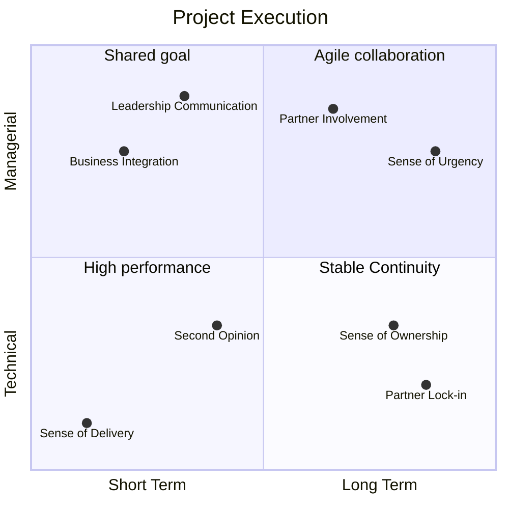
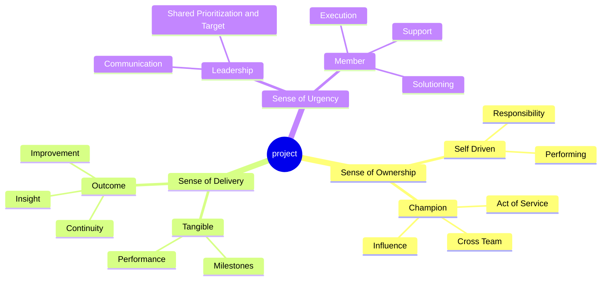

# 👥 Pembuka

Disclaimer saya tidak suka kata vendor karena pernah di posisi tersebut, sehingga lebih suka menyebutnya sebagai partner. Tetapi memang kata vendor kuat, karena secara gamblang adalah sebagai pihak luar yang dilibatkan. Jadi ijin menggunakan kata vendor tanpa ada maksud apapun. Lagi, saya pernah menjadi partner teknologi.

Di dalam bekerja saya selalu percaya bahwa hasil adalah yang utama, baik itu dilakukan secara individual ataupun kolaborasi. Pada tulisan berikut saya ingin menuangkan pemikiran tentang development proyek, baik impact menengah atau yang berdampak luas ke organisasi dan kerap butuh analisa untuk dieksekusi secara internal atau butuh tenaga bantuan luar.

Beberapa waktu lalu sempat ada diskusi "_seharusnya sebuah perusahaan utilisasi tim internal teknis membangun sistem IT_". Pertanyaan dengan bab yang luas. Kalau merefleksikan, kapan saya butuh vendor untuk mengerjakan? Untuk menjawabnya pasti ada 4 sudut yang pertama kali dipikirkan yaitu _scope, timeline, resource,_ dan _budget_.

4 sudut yang menjadi persegi menyebalkan dengan segala permutasinya. Tetapi katakanlah scope besar, timeline mencukupi, resource mendukung, dan budget ada. Resource yang paling challenging karena butuh kolaborasi. Karena tidak semua orang sepemahaman apalagi jika tidak satu ada gap visi, kemampuan, silo, dan membawa agendanya masing-masing.

# 🧑🏽‍💻 Memulai In-House
Pada bagian pembuka sebetulnya sudah jelas, dengan adanya jumlah resource yang memadai baik jumlah serta skill bukan artinya eksekusi akan selaras. Adanya endorsement dari manajemen bukan jadi jaminan apalagi jika management juga silo dari top level. Saya akan mulai dengan ideal apabila ingin memulai IT development dengan in-house. 

## Sense yang Dibangun

Untuk dapat memulai proyek in-house dengan lancar harus ada 3 top sense yang dibutuhkan menurut pandangan saya. Sebuah teori yang ada di kepala dan menurut keyakinan pribadi saja. Dan juga berhasil dilakukan di Bank Mandiri oleh atasan saya dulu dan entah kenapa banyak perusahaan lain yang denial, padahal ketika diskusi atau interview mereka sadar bahwa hal tersebut valid.

### Sense of Urgency

Proyek yang digerakkan oleh urgensi menjadi terasa penting. Sekiranya di setiap coaching leadership pasti dibekali dengan pengetahuan mengenali kepribadian tim lewat DISC (Dominance, Influence, Steadiness, dan Conscientiousness). Apapun bentuk anggota, pasti masing-masing mewakili karakteristik tersebut. Satu hal yang pasti, mereka patuh dan selaras apabila diberikan urgensi.

Ketika semua tim in-house mendapatkan uraian kenapa proyek sangat penting, maka mereka akan tergerak. Dengan catatan urgensi tersampaikan oleh leader dengan tepat: 
1. Anggota dengan kepribadian Dominance (D) akan berambisi terhadap hasil dan milestone eksekusinya karena paham prioritas akan target oleh manajemen.
2. Anggota dengan kepribadian Influence (I) akan tergerak untuk segera berkolaborasi dengan tim lain karena paham aktivitas tidak akan berjalan tanpa tim lain.
3. Anggota dengan kepribadian Steadiness (S) akan siap selalu support semua tim karena paham prioritas proyek penting untuk kemashalatan bersama.
4. Anggota dengan kepribadian Conscientiousness (C) akan siap memikirkan solusinya segera dan seksama karena paham prioritas penuh tantangan.

### Sense of Ownership

Ownership atau kepemilikan tidak diatur oleh prioritas karena sebuah karakter. Sama seperti kru di dalam satu kapal, tidak semua kru beranggapan bahwa tidak wajib rutin berlatih bersama karena belum akan melaut. Tetapi karakter yang mengutamakan ownership tidak akan memilah, dengan sendirinya sadar untuk kompak dan bertanggung jawab sesuai bidang meski belum akan melaut.

Ketika di proyek besar, ownership bermanfaat sebagai katalis atau penggerak tanpa perlu daya besar untuk diarahkan. Individu dengan karakter tersebut akan bertanggung jawab tanpa diminta terhadap apa yang dikerjakan apalagi dengan skala besar. Sehingga ada istilah _champion_ atau organik yang terpilih. 

Terkait role _champion_, harus personel yang memiliki ownership tinggi di bidangnya dan ditugaskan bersama _champion_ lain yang terlibat. Uniknya, perusahaan tidak perlu repot mendikte semua orang yang terlibat memiliki ownership. Itu seperti memberikan garam di lautan. Jadi memang tidak semua anggota menjadi _champion_, biarkan pengaruh itu menyebar dengan sendirinya. 

### Sense of Delivery

Adalah sebuah sikap untuk pro-aktif, berorientasi pada hasil, dan konsisten untuk menghasilkan outcome. Outcome, bukan hanya result yang tampak high perform. Outcome itu jangka panjang karena di proyek yang harus dijamin adalah sustainabilitynya. Siapa yang akan menjadi penanggung jawabnya? Tentunya harus dari organik dari perusahaan itu sendiri.

Sikap yang mirip dengan mindset marathon dan harus dimiliki oleh personel organik yang terlibat dengan tetap memperhatikan pacenya. Harus tahu bagaimana cara menyelesaikan tasks, kapan harus cepat menyelesaikan milestone, kenapa masih ada yang tidak perform, dan apa target selanjutnya. Karena kompleksitas di skala besar itu banyak permutasi permasalahannya.

Jangan cepat puas adalah key takeaway yang saya dapatkan dari mantan SVP di Bank Mandiri. Dengan percaya diri saya menyatakan bahwa layanan channel loan skala nasional dan terintegrasi dengan multiple well known payment providers yang dibangun dalam waktu 4 bulan, mampu menangani ~5.000 s/d 10.000 req/s sesuai permintaan direktur bisnis. 

Apa yang beliau sampaikan masih terngiang hingga saat ini dan membentuk cara berpikir. "_I heard, but that is not clear enough as I wonder on how much resources that must be wasted to achieve that results. If that so, then you shall judge by yourself for all that you have done_" Saya hanya fokus apa yang sudah achieve, tetapi tidak membawa apa yang dapat diimprove agar ke depan.

## Challenge

Development proyek secara in-house menjadi masuk akal apabila 3 top sense di atas terpenuhi. Terlepas dari budget yang dapat dialokasikan ke hal lain. Dan dengan catatan kenapa skill tidak dimasukkan? Karena di setiap organisasi pasti ada si perform, si medioker, dan si under perform. Dan masing-masing skill tidak mewakilkan sensenya, hanya mewakilkan resultnya.

Secara realita 3 top sense selalu terhalang oleh beberapa kebiasaan buruk dari in-house yang menjadi deal-breaker sebagai berikut

| Key Behavior | Driver | Sifat | Missing Sense | 
| --- | --- | --- | --- |
| **Tidak semua orang memiliki urgensi yang sama** | Leadership tidak cakap dan bahkan tidak memberikan urgensi kepada setiap anggota tim agar tergerak. Diberikan urgensi dan tergerak saja mungkin tidak optimal eksekusinya, apalagi jika tidak diberikan urgensi. | Eksekusi urgensi dengan atribusi daripada kontribusi. Hanya nama tercantum ada di meeting tetapi tidak bergerak, tidak sadar bahwa urgensi milik bersama. Pemberian dukungan antar tim menjadi terbatas. | _Sense of Urgency_, _Sense of Ownership_ |
| **Sudah punya agenda masing-masing** | Semua bagian sudah punya visi dan misi masing-masing tanpa ingin tahu atau ingin tahu tetapi dukungannya terbatas. Semua didasarkan terhadap goal dan target masing-masing tetapi minim konsolidasi. | Lamanya pengambilan keputusan. Adanya duplikasi solusi serta output, pekerjaan yang sama semakin banyak. Akhir hasil yang suboptimal terhadap costs di operasional di kemudian hari. | _Sense of Urgency_, _Sense of Delivery_ |
| **Banyak yang berpikir, tapi tidak semua bekerja** | Semua terlalu banyak menuangkan idealisme di awal tetapi minim menjalankan idenya, entah sebetulnya mampu atau tidak mampu. Saklek terhadap existing scope pekerjaannya dan anti terhadap dinamika perubahan requirement. | Ala kadarnya, menunda, bahkan menolak perubahan. Perhitungan yang tidak masuk akal terhadap effort dari pekerjaan hingga hasilnya tidak sesuai grand desain. Jadi beban optimalisasi di kemudian hari. | _Sense of Ownership_, _Sense of Delivery_ | 
| **Bekerja dengan silo raksasa yang terstruktur dan sistematis** | Adalah rangkuman dari semua baris di atas, masing-masing menjadi koloni pekerja yang dominan, paling benar, atau yang paling merasa seharusnya tidak dilibatkan (tapi ingin tetap dapat bagian). | Semua sifat negatif akan muncul: defensif, penimbunan informasi tanpa distribusi, dan ego sektoral terhadap duplikasi KPI. Hanya ada kata "aku" atau "kami", tidak ada kata "kita" di dalam kolaborasi. | _All_ |

# Solusi Vendor
Bagi saya tidak ada kata "amin" bahwa vendor adalah obat resource yang terbatas, namun setuju menjadi "parasetamol". Vendor juga sebagai solusi challenge sense di in-house, karena bergerak bukan karena sense tetapi nominal proyek. Vendor akan memberikan role yang tepat terlepas pada penawaran terlepas personelnya mampu (termasuk cepat) atau tidak untuk eksekusi.

## Silo Breaker

Pengalaman bekerja dengan well-known vendor konsultan multi nasional seperti Accenture, Deloitte, Kyndryl, McKinsey, dan ThoughtWorks juga beberapa lokal memiliki kesamaan pola dalam bekerja. Pada dasarnya mereka tidak mengenal detail klien, mereka cukup menempatkan personelnya atas permintaan role.

Hal tersebut menjadi menjadi kelebihan bukan kekurangan untuk mendobrak rangkuman terbesar terkait Silo. Kenapa? Pragmatisme untuk mencapai tujuan. Berikut adalah nilai tujuan pragmatisme yang menjadi pemecahan masalah?

* **Obyektif berbasis kontrak**, membawa mandat yang sangat spesifik dan tidak terjebak dalam politik kantor termasuk agenda jangka panjang meski harus menggasak ego sektoral di klien.
* **Obsesif terhadap timeline**, takut terlambat karena menjadikan kerugian finansial (penalti), berani mengetuk pintu setiap organik yang terlibat dan menghambat milestone. 
* **Katalis pengambilan keputusan**, membawa best practice atau alternatif dan pertimbangan meski pragmatis dalam eksekusi untuk mendorong pengambilan keputusan.
* **Netral sebagai pihak luar**, melihat klien dari sudut terluar, dapat bertanya "apa kebutuhannya", "kenapa seperti itu", dan "kapan eksekusinya" tanpa dianggap menantang karena agendanya hanya satu yaitu proyek.
* **Standarisasi komunikasi**, memaksakan satu protokol komunikasi atau _tooling_ yang sama agar dapat meruntuhkan silo komunikasi untuk memberikan informasi yang komprehensif.

Apa saja bentuk pragmatisme secara detail saya sampaikan menjadi 2 bentuk utama, dan yang biasa dilakukan oleh vendor tersebut di lapangan.  

### Business Integration
Eksekusi yang pertama adalah vendor menempatkan personal sebagai agen lapangan di setiap bagian organik yang terlibat. Agen tersebut biasanya tidak bukan tim teknis, mostly sebagai relay informasi yang membawa target tugas dan membuat insight. Simple dan receh tugasnya hanya memaparkan tugas yang harus dikerjakan oleh organik di bagian tersebut dan follow-up. 

Dependensi tugas disampaikan ke bagian organik lain atau agen yang ada di sana untuk diselesaikan. Dengan seperti itu silo akan terkoneksi lewat eksternal. Ibarat seperti menggunakan magnet yang efektif demi hanya untuk menghubungkan antar silo. Dan tidak lupa untuk melaporkan semua laporan dengan detail progressnya termasuk blocker kepada stakeholder proyek.

> Dari semua laporan akan dibantu oleh agen untuk membentuk rangkuman pencapaian, perencanaan strategis untuk improvement, dan tone dari blockernya adalah positif input

Kenapa tone dari selalu positif input? Karena tidak ada yang suka dipecut dengan hal negatif. _Rule of thumb_ adalah _sugar coating to warn and offer the cure_ agar dapat diterima oleh pihak yang diserang. Saya secara personal setuju, untuk apa sibuk menghabiskan energi mendobrak pintu agar semua organik bergerak. 

Semua pemikiran didasari pengalaman saya pernah menjadi agen tersebut. Titlenya keren yaitu Business Architect dan mandays dibayar cukup mahal padahal hanya bermodal analisa dan sikap taktis.

### As Second Opinion
Personel yang ditempatkan oleh vendor untuk eksekusi proyek pastinya adalah orang yang setidaknya paham terkait teknis. Mereka dituntut result-oriented, agnostik, dan respon yang relevan. Agnostik dan respon relevan adalah hal menarik berdasarkan pengalaman saya menjadi konsultan yang pragmatis, yaitu perihal manajemen resiko dan fleksibilitas eksekusi.

Pada dasarnya vendor dihire untuk mengisi gap kekosongan yang ada di klien, entah itu resource, skill, atau teknologi. Vendor dituntut untuk mengisi pertanyaan 2W1H:
1. Apa kebutuhan untuk mengatasi masalah saya?
2. Mengapa solusi tersebut dapat mengatasi masalah saya?
3. Bagaimana eksekusi solusi tersebut?

Ultimatenya adalah saya sebagai vendor sering jemput bola, sebelum muncul 2W1H adalah sudah harus identifikasi dan menyampaikan masukkan sebelum ditanya.

Biasanya 2W1H itu muncul ketika akan atau sedang eksekusi proyek besar, jadi tidak muncul di permukaan awal. Dari timing tersebut vendor akan semakin bermanfaat karena dapat memberikan sudut pandang baru. Termasuk ketika tim organik memiliki opsi solusi, vendor dapat memberikan dukungan statemennya. Juga selain melakukan counter statement, vendor dapat memberikan dukungan perlawanan.

Ibarat dari 2 tim sepak bola yang berbeda melakukan latihan sparring bersama sebelum pertandingan dan saling memberikan input termasuk analisa. Vendor selain menjadi augmented resource akan memberikan added value berupa bantuan berpikir yang membuat proyek akan semakin matang dalam perencanaan dan eksekusi.

Ironis kelemahan dari in-house yang silo adalah tidak dapat mematangkan identifikasi kelebihan dan kekurangan sendiri sedari awal sampai saat harus menghadapi masalah secara langsung. Vendor memiliki jurus terbaik yaitu gap analysis yang menunjang kemampuan untuk menjadi second opinion dan sebagai pihak netral mereka diuntungkan karena terhindar conflict of interest.

## Challenge
Persis statement awal yaitu vendor adalah parasetamol atau pereda nyeri. Vendor akan mengakibatkan ketergantungan dan beban biaya yang tidak terlihat dan tidak mengobati masalah struktural internal karena tugas utamanya sebagai augmented resource. Saya pernah menyampaikan challenge berikut ketika sesi interview untuk membantah statement "pendapatmu tidak valid jika organik dominan". 

| Symptom | Driver | Side Impact |
| --- | --- | --- |
| Keputusan disetir vendor secara mayoritas (banyak) ada yang tidak setuju | Vendor mendorong keputusan diambil dan apabila tidak diambil maka akan ter-eskalasi hingga top level untuk diambil. Pasal penalti tidak berlaku ketika blocker ada pada _user_, karena vendor tidak pernah bertanggung jawab memberikan keputusan, sudah ada hukum yang mengatur di procurement. | _Second Opinion_ |
| Hasil laporan tidak faktual dan akurat, ada fabrikasi kuantitas serta kualitas | Vendor menggunakan data untuk dapat "menekan" pengambilan keputusan stakeholder dengan dibuat sangat **turun**, atau untuk dapat "closing" secepatnya dengan dibuat sangat **baik** atau untuk "menenangkan" situasi dengan dibuat **normal** | _Business Integration_, _Second Opinion_ |
| Proses hand-over yang _cluttering_ di akhir dan menjadi tidak bertuan | Vendor tidak bertugas membuat organik menjadi pintar. Pada ukuran proyek yang besar mereka sibuk mengumpulkan artefak dokumentasi yang kompleks, banyak, dan arrange sesi training yang singkat demi closing. Penyerapan ilmu oleh organik untuk dapat melanjutkan tidak pernah jadi tanggung jawab vendor sekalipun beli jasa support. | _Business Integration_ |
| Tanggung jawab akhir yang harus berlanjut sangat memberatkan dan berujung additional **costs** | Intinya _ice berg_ technical debt dari vendor tidak akan seutuhnya terlihat, yang terlihat hanya masalah implementasi. Ujungnya _organik_ membeli support dengan ketergantungan untuk keberlanjutan pengembangan selanjutnya dan repetitif. | _All_ |

Kembali tentang challenge "tidak akan terjadi ketika organik dominan" sangat simple yaitu dari sisi persegi **timeline**, "_siapa yang berani menghambat timeline proyek besar permintaan C-Level untuk debat mekanik sekalipun itu VP_?" dan "_adanya vendor di RACI untuk eksekusi maka seberapa besar A(ccountability) dan R(esponsibility)nya di in-house_?" Pertanyaan balik ini mengantarkan saya lolos interview di Pertamina. 

Semua yang berbasis industri engineering baik itu instalasi infrastruktur, energy, dan teknologi informasi kedua pertanyaan di atas teknikal karena terkait politik dan eksekusi. Lagi, terkait kontrol dan hasil yang dinilai dari organik yang mengatur proyek. Ya kali terima jadi tanpa kontrol, nanti menjadi boomerang.

# Kesimpulan

Apakah menurut saya dari diskusi seharusnya utilisasi in-house organik harus dioptimalkan, iya tetapi ada sense yang minimal dibangun untuk _champion_. Apakah harus dengan vendor jawabannya adalah tidak harus tetapi sebaiknya ada untuk proyek besar sebagai augmented resource. Berikut adalah peran dari senior leader minimal VP atau powernya dari C-Level menurut pengalaman enable in-house:
1. Menetapkan _champion_ dengan tebang pilih, melibatkan personel organik yang mau bekerja pada satu visi misi daripada yang jago tapi menghambat dan jangan segan meminggirkan para blocker.
2. Memberikan target dan resiko apabila proyek tidak dieksekusi secara tertulis, apabila perlu resiko dibungkus dalam bentuk "intimidasi" jika tidak dieksekusi.
3. Define scope over mencari pekerjaan untuk melarisi vendor, konyol sekali talent organik dibayar mahal apalagi _champion_ untuk digantikan pekerjannya oleh vendor.
4. Meminta organik untuk update laporan berkala di steering committee update, untuk memastikan organik paham meski data dari vendor.

Dan kapan harus menggunakan vendor? Lagi terkait estimasi pekerjaan di awal lewat persegi proyek apapun kondisinya yang terbaik adalah jangan pernah terima jadi oleh vendor, hybrid development dengan model 50% organik dan 50% vendor untuk eksekusi. Seperti apa detail rulesnya?
1. Memastikan semua ide dan desain berangkat dari organik dan terdokumen, detail tambahan dan implementasi dapat dibuat oleh vendor. Sehingga semua artefak ada di setiap bagian tim tanpa perlu menunggu vendor menyusun di akhir.
2. Menempatkan fase review tepat sebelum testing dengan organik yang melakukan review untuk memberikan feedback, biarkan konflik berada di implementasi.
3. Membuat struktur _project coordinator_ melalui _champion_, sehingga semua konflik di ranah teknis dapat disolusikan di teknis tanpa perlu muncul di update steering committee.
4. Menempatkan personel organik yang memiliki kepribadian Steadiness (S) dan Conscientiousness (C) untuk melakukan review terhadap laporan vendor, dari pengalaman saya rule berikut sangat efektif untuk membentuk laporan yang ada insight namun relevan.
5. Membuat vendor mostly under surface untuk tetap berada di area implementasi terlepas mereka punya role project management. Tarik mereka ke permukaan hanya untuk mendukung statement organik ketika memberikan penjelasan detail atau dibantah. 

Last but not least, bekerja di perusahaan besar tidak membuat saya berpikir "_sudah mahal bayar vendor kenapa harus turun tangan_?", karena top level juga dapat berkata "_saya bisa langsung minta vendor yang handle pekerjaan, kenapa masih harus bayar dengan mempekerjakan kamu_?" Jadi top 3 sense jadi added value bagi organik kenapa mereka masih berharga, terlepas tetap dibantu vendor.

Atau bisa jadi vendor akan menjadi atasan suatu saat, who knows?
